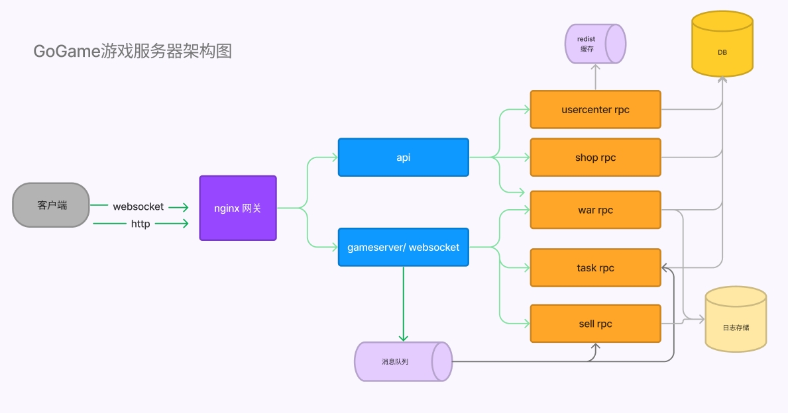

 

### 1.介绍
 
go-game 是一款基于Go语言开发的支持分布式与微服务架构的游戏服务器。 支持单体、分布式等多种架构方案。 
本游戏框架居于 gozero+gorm 微服务框架开发，可复用go-zero的grpc调用，服务治理，消息队列，日志，链路追踪等功能  \
通讯使用zinx框架支持 websocket ，http ，kcp ，tcp 多种通讯方式， 支持protobuf，json 协议。   \
消息队列支持kafka、redis、nats \
日志支持文件模式，elasticsearch模式，支持prometheus性能监控等。 

client 提供一个居于  layabox typescript protobuf 的客户端 即时战斗 mmo rpg 游戏 demo。
 
 
 
### 2.背景现状

老一代的游戏服务器框架中，游戏相关的逻辑都放在单一服务器，单一服务器有性能瓶颈，特别是复杂的战斗运算等，通常一个区只能达到数千人的规模。 单体服务的代码复杂，往往伴有不少bug，维护和测试都相当困难，服务器出bug宕机时将导致整区停服。 一些老游戏服务器也会把聊天服务器，拍卖行服务器，商城服务器，工会服务器等拆分成独立的进程或独立服务器。但还是基于各自独立编码的方式，没有统一的标准，导致项目变的更加庞杂难以维护。


### 3.本项目优势
 
  本项目居于成熟的微服务器框架和通讯框架构 \
  充分利用http短连接 和websocket 长连接的各自优点处理游戏场景 \
  适合大世界模式游戏， 回合制，战旗 等类型的游戏开发，虚拟社区 ，微信小游戏等\
  也适合即时战斗类，帧同步类的 MMORPG类型游戏 \
  适合即时通讯类的应用开发 

  ### 4.目录结构

  ```golang

   gameserver  //服务器
      doc
         game.sql // 数据库
      app
         usercenter
            cmd
               api
               rpc
         basic 
            cmd 
               api 
               rpc
         game
            cmd
               api
                  internal
                     gameserver // 游戏服务器 wss/tcp /kcp
                       pb/msg.proto // protobuf 定义文件
               rpc

    client      //客户端
        layabox  // layabox 客户端demo  
        h5      //    vue/h5 客户端 demo          
     

```
     
  ### 5. 启动服务

  ```language

usercenter
 
  go run ./app/usercenter/cmd/rpc/usercenter.go  -f app/usercenter/cmd/rpc/etc/usercenter.yaml 
  go run ./app/usercenter/cmd/api/usercenter.go  -f app/usercenter/cmd/api/etc/usercenter.yaml
 

  basic
  go run ./app/basic/cmd/api/basic.go  -f app/basic/cmd/api/etc/basic.yaml
 
  game 
  go run ./app/game/cmd/api/game.go  -f app/game/cmd/api/etc/game.yaml
 

```


        


 